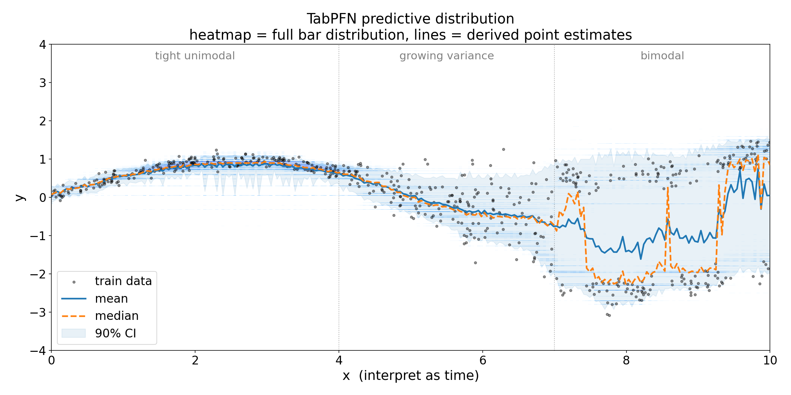
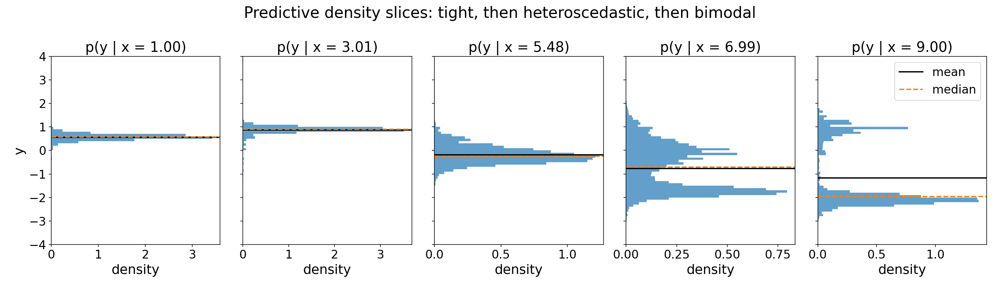
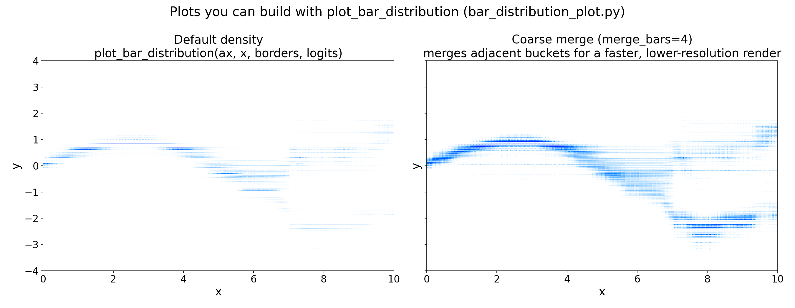

# TabPFN Predictive Distribution

`TabPFNRegressor` does not just predict a single value. It predicts an entire
probability distribution over the target, called the **bar distribution**. The
default `.predict(X)` call collapses that distribution to its mean for
sklearn compatibility, but the full distribution is available through
`predict(X, output_type="full")` and is what powers every other output type
(median, mode, quantiles, intervals).



*Per-x predictive density on a toy problem with three regimes: tight unimodal
noise for `x < 4`, growing variance for `4 < x < 7`, and bimodal noise
(`±1.5`) for `x > 7`. Each vertical column is the model's posterior
`p(y | x)`. In the bimodal region the mean (solid) sits in the empty trough
between modes while the median (dashed) snaps to whichever mode currently
carries more than half the mass and oscillates between the two as the local
mixing ratio shifts. Both behaviors are textbook failure modes of a single
point estimate.*

This folder shows how to read, visualize, and post-process the bar
distribution.

> Requires the local `tabpfn` package. The cloud `tabpfn-client` does not
> return raw logits, so `output_type="full"` is unavailable there.

## What is the bar distribution?

TabPFN treats regression as classification over a fixed grid of buckets on
the target axis. Concretely, the model outputs a logit per bucket; a softmax
turns those into bucket probabilities, and within each bucket the density is
assumed uniform. The result is a **piecewise-uniform probability density**
over `y`:

```
density(y) = softmax(logits)[k] / width[k]    for y in [border[k], border[k+1])
```

with `k = 0 ... num_bars - 1`. The buckets are non-uniform: they're packed
densely near the bulk of the training targets and spread out into long tails.
Borders and widths live on the fitted criterion at
`reg.predict(..., output_type="full")["criterion"]`.

This representation is what lets a single transformer forward pass capture
heteroscedastic noise, multi-modal posteriors, and asymmetric tails without
assuming any parametric form.

## Getting the full distribution

```python
from tabpfn_extensions import TabPFNRegressor

reg = TabPFNRegressor()
reg.fit(X_train, y_train)

preds = reg.predict(X_test, output_type="full")
# preds is a dict:
#   "mean", "median", "mode"   : point estimates (np.ndarray, shape (n,))
#   "quantiles"                : list of np.ndarray, one per requested quantile
#   "criterion"                : the BarDistribution object (.borders, .bucket_widths, ...)
#   "logits"                   : torch.Tensor of shape (n, num_bars)
```

Other `output_type` values are convenience shortcuts:

| `output_type` | Returns                                       |
| ------------- | --------------------------------------------- |
| `"mean"` (default) | `np.ndarray`, shape `(n,)`               |
| `"median"`    | `np.ndarray`, shape `(n,)`                    |
| `"mode"`      | `np.ndarray`, shape `(n,)`                    |
| `"quantiles"` | `list[np.ndarray]` for `quantiles=[...]`      |
| `"main"`      | dict with the four above                      |
| `"full"`      | `"main"` plus `"criterion"` and `"logits"`    |

## From distribution to point estimate

The three standard summaries are all derived from the same `(logits, criterion)`
pair. `output_type="mean"` is just a convenience call to `criterion.mean(logits)`.

### Mean
Probability-weighted average over bucket centers:

$$
\mathbb{E}[y \mid x] = \sum_{k} p_k \cdot \tfrac{1}{2}\big(b_k + b_{k+1}\big)
$$

where `p_k = softmax(logits)[k]` and `b_k` are the bucket borders.

### Median
The 0.5-quantile, found by inverting the CDF. The CDF is exact under the
piecewise-uniform assumption: cumulative mass up to the containing bucket
plus a linear interpolation within it.

$$
\mathrm{median} = F^{-1}(0.5), \qquad F(y) = \sum_{k:\,b_{k+1}\le y} p_k + p_{k^\star}\cdot\frac{y - b_{k^\star}}{b_{k^\star+1} - b_{k^\star}}
$$

Here $k^\star$ denotes the index of the bucket containing $y$, i.e. the unique
$k$ with $b_k \le y < b_{k+1}$.

### Mode
The bucket with the highest **density** (probability divided by width), since
buckets are not equally wide:

$$
\mathrm{mode} = \tfrac{1}{2}(b_{k^\star} + b_{k^\star+1}), \quad k^\star = \arg\max_k \frac{p_k}{b_{k+1} - b_k}
$$

### Quantiles and credible intervals
A central 90% interval is just two inverse-CDF calls:

```python
criterion = preds["criterion"].to("cpu")
logits = preds["logits"].detach().cpu()

lower = criterion.icdf(logits, 0.05).numpy()   # 5th percentile
upper = criterion.icdf(logits, 0.95).numpy()   # 95th percentile
```

### When to use which

| Output | Best for                                                |
| ------ | ------------------------------------------------------- |
| Mean   | MSE-style metrics, optimal-under-squared-loss baselines |
| Median | Robust to heavy tails; minimizes MAE                    |
| Mode   | "Most likely" answer when the posterior is multimodal. Note: a unimodal mode is rarely meaningful for skewed posteriors |
| Quantiles | Calibrated intervals and risk-aware decision making  |

For a multimodal predictive distribution (e.g. when several plausible
outcomes are consistent with `x`), the mean falls **between** the modes. It
is the right answer under squared loss but not a typical sample. In that
case, prefer the median, the mode, or, better, keep the full distribution.



*Each panel is a 1D slice of the heatmap above: `p(y | x)` at a fixed `x`.
For `x in {1, 3}` the distribution is tight and unimodal, so mean and median
agree. At `x = 5.5` the variance has grown but the distribution is still
unimodal. By `x = 7` and `x = 9` two modes appear at roughly `±1.5`; the
mean sits in the empty trough between them while the median snaps to the
dominant mode. This is the failure mode the bar distribution is built to
expose.*

## Visualizing the bar distribution

`bar_distribution_plot.py` provides `plot_bar_distribution`, which renders the
per-sample predictive density as a heatmap column. It expects a 1D `x` so it
suits low-dimensional inputs or projections.

```python
import matplotlib.pyplot as plt
import torch
from bar_distribution_plot import plot_bar_distribution

fig, ax = plt.subplots(figsize=(12, 6))
plot_bar_distribution(
    ax,
    torch.tensor(X_test[:, 0]),          # 1D x-positions
    preds["criterion"].borders.cpu(),    # bucket borders
    preds["logits"].detach().cpu(),      # logits (n, num_bars)
    restrict_to_range=(-4.0, 4.0),       # optional y-axis crop
)
```

### Plots you can build with `plot_bar_distribution`

The same helper produces two main views depending on its keyword arguments.
The example script renders both side by side so you can pick the one that
best fits your use case:



- **Default density** (no extra args): linear-scale piecewise-uniform
  density, one column per test point. Best for showing where the model
  concentrates mass.
- **Coarse merge** (`merge_bars=k`): merges `k` adjacent buckets into one
  before rendering. Much faster on dense grids and cleaner when buckets are
  finer than your eye needs.

Other useful arguments:
- `restrict_to_range=(y_min, y_max)`: crop the y-axis and skip buckets that
  fall entirely outside it (fewer rectangles, faster plot).
- `plot_log_probs=True`: plot log-density instead of density; useful when a
  few buckets dominate.
- `palette=`: any matplotlib colormap. The default is a `seaborn`
  cubehelix.

## Run the example

```bash
python examples/predictive_distribution/predictive_distribution_example.py
```

Regenerates all three figures shown above:
- `tabpfn_bar_distribution.png`: heatmap of the predictive density on a 1D
  toy problem with three regimes (tight unimodal, growing variance,
  bimodal), overlaid with the training data, mean/median point estimates,
  and a 90% credible interval.
- `tabpfn_bar_distribution_variants.png`: a 1x2 showcase of the two main
  views `plot_bar_distribution` can render (default density and coarse
  merge).
- `tabpfn_density_slices.png`: 1D `p(y | x)` slices at five selected test
  points, showing how the mean and median behave under multimodal posteriors.
