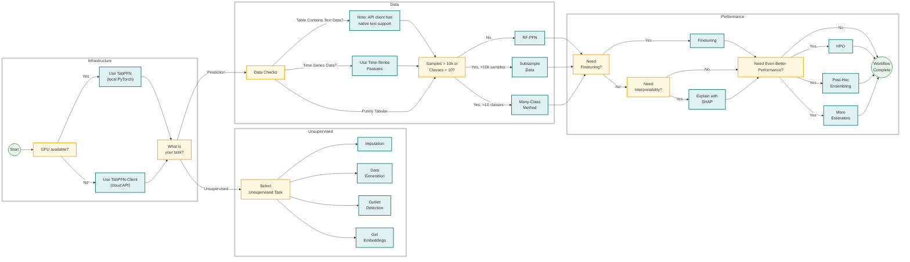

```mermaid
---
config:
  theme: 'default'
  themeVariables:
    edgeLabelBackground: 'white'
---
graph LR
    %% 1. DEFINE COLOR SCHEME & STYLES
    classDef default fill:#fff,stroke:#333,stroke-width:2px,color:#333;
    classDef start_node fill:#e8f5e9,stroke:#43a047,stroke-width:2px,color:#333;
    classDef process_node fill:#e0f2f1,stroke:#00796b,stroke-width:2px,color:#333;
    classDef decision_node fill:#fff8e1,stroke:#ffa000,stroke-width:2px,color:#333;

    style Infrastructure fill:#fff,stroke:#ccc,stroke-width:5px;
    style Unsupervised fill:#fff,stroke:#ccc,stroke-width:5px;
    style Data fill:#fff,stroke:#ccc,stroke-width:5px;
    style Performance fill:#fff,stroke:#ccc,stroke-width:5px;

    %% 2. DEFINE GRAPH STRUCTURE
    subgraph Infrastructure
        start((Start)) --> gpu_check["GPU available?"];
        gpu_check -- Yes --> local_version["Use TabPFN<br/>(local PyTorch)"];
        gpu_check -- No --> api_client["Use TabPFN-Client<br/>(cloud API)"];
        task_type["What is<br/>your task?"]
    end

    local_version --> task_type
    api_client --> task_type

    end_node((Workflow<br/>Complete));

    subgraph Unsupervised
        unsupervised_type["Select<br/>Unsupervised Task"];
        unsupervised_type --> imputation["Imputation"]
        unsupervised_type --> data_gen["Data<br/>Generation"];
        unsupervised_type --> density["Outlier<br/>Detection"];
        unsupervised_type --> embedding["Get<br/>Embeddings"];
    end


    subgraph Data
        data_check["Data Checks"];
        model_choice["Samples > 10k or<br/>Classes > 10?"]
        data_check -- "Table Contains Text Data?" --> api_backend_note["Note: API client has<br/>native text support"];
        api_backend_note --> model_choice;
        data_check -- "Time-Series Data?" --> ts_features["Use Time-Series<br/>Features"];
        ts_features --> model_choice;
        data_check -- "Purely Tabular" --> model_choice;
        model_choice -- "No" --> rfpfn["RF-PFN"];
        model_choice -- "Yes, >10k samples" --> subsample["Subsample<br/>Data"];
        model_choice -- "Yes, >10 classes" --> many_class["Many-Class<br/>Method"];
    end

    subgraph Performance
        finetune_check["Need<br/>Finetuning?"];
        interpretability_check["Need<br/>Interpretability?"];
        performance_check["Need Even Better Performance?"];

        finetune_check -- Yes --> finetuning["Finetuning"];
        finetune_check -- No --> interpretability_check;

        finetuning --> performance_check;
        interpretability_check -- Yes --> shapley["Explain with<br/>SHAP"];
        interpretability_check -- No --> performance_check;
        shapley --> performance_check;

        performance_check -- No --> end_node;
        performance_check -- Yes --> hpo["HPO"];
        performance_check -- Yes --> post_hoc["Post-Hoc<br/>Ensembling"];
        performance_check -- Yes --> more_estimators["More<br/>Estimators"];

        hpo --> end_node;
        post_hoc --> end_node;
        more_estimators --> end_node;
    end

    %% 3. LINK SUBGRAPHS AND PATHS
    task_type -- "Prediction" --> data_check;
    task_type -- "Unsupervised" --> unsupervised_type;

    rfpfn --> finetune_check;
    subsample --> finetune_check;
    many_class --> finetune_check;

    %% 4. APPLY STYLES
    class start,end_node start_node;
    class local_version,api_client,imputation,data_gen,density,embedding,api_backend_note,ts_features,rfpfn,subsample,many_class,finetuning,shapley,hpo,post_hoc,more_estimators process_node;
    class gpu_check,task_type,unsupervised_type,data_check,model_choice,finetune_check,interpretability_check,performance_check decision_node;

    %% 5. ADD CLICKABLE LINKS (RESTORED FROM ORIGINAL)
    click local_version "https://github.com/PriorLabs/TabPFN" "TabPFN Backend Options" _blank
    click api_client "https://github.com/PriorLabs/tabpfn-client" "TabPFN API Client" _blank
    click api_backend_note "https://github.com/PriorLabs/tabpfn-client" "TabPFN API Backend" _blank
    click unsupervised_type "https://github.com/PriorLabs/tabpfn-extensions" "TabPFN Extensions" _blank
    click imputation "https://github.com/PriorLabs/tabpfn-extensions/blob/main/examples/unsupervised/imputation.py" "TabPFN Imputation Example" _blank
    click data_gen "https://github.com/PriorLabs/tabpfn-extensions/blob/main/examples/unsupervised/generate_data.py" "TabPFN Data Generation Example" _blank
    click density "https://github.com/PriorLabs/tabpfn-extensions/blob/main/examples/unsupervised/density_estimation_outlier_detection.py" "TabPFN Density Estimation/Outlier Detection Example" _blank
    click embedding "https://github.com/PriorLabs/tabpfn-extensions/tree/main/examples/embedding" "TabPFN Embedding Example" _blank
    click ts_features "https://github.com/PriorLabs/tabpfn-time-series" "TabPFN Time-Series Example" _blank
    click rfpfn "https://github.com/PriorLabs/tabpfn-extensions/blob/main/examples/rf_pfn/rf_pfn_example.py" "RF-PFN Example" _blank
    click many_class "https://github.com/PriorLabs/tabpfn-extensions/blob/main/examples/many_class/many_class_classifier_example.py" "Many Class Example" _blank
    click finetuning "https://github.com/PriorLabs/TabPFN/blob/main/examples/finetune_classifier.py" "Finetuning Example" _blank
    click shapley "https://github.com/PriorLabs/tabpfn-extensions/blob/main/examples/interpretability/shap_example.py" "Shapley Values Example" _blank
    click post_hoc "https://github.com/PriorLabs/tabpfn-extensions/blob/main/examples/phe/phe_example.py" "Post-Hoc Ensemble Example" _blank
    click hpo "https://github.com/PriorLabs/tabpfn-extensions/blob/main/examples/hpo/tuned_tabpfn.py" "HPO Example" _blank
    click subsample "https://github.com/PriorLabs/tabpfn-extensions/blob/main/examples/large_datasets/large_datasets_example.py" "Large Datasets Example" _blank
```